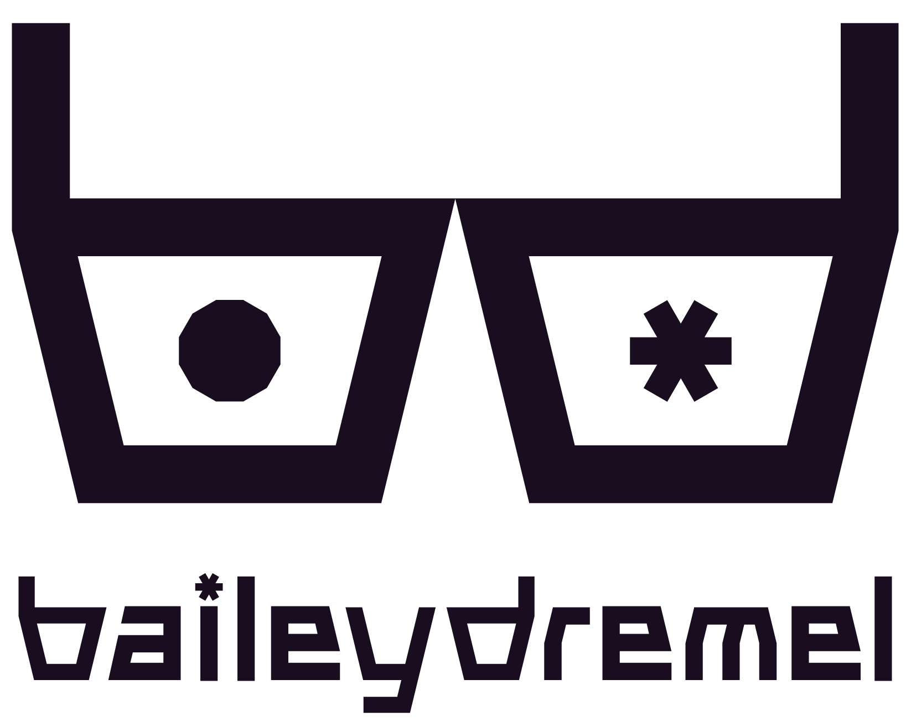

# baileydremel - New Website

    <strong>
        The new homepage for Bailey Dremel
    </strong>

    <picture align="center">
        <source media="(prefers-color-scheme: dark)" srcset="./assets/logomarkdarktheme.png">
        
    </picture>

A personal project created by Bailey Dremel (that's me) to serve as the website for all things me. 

If you've stumbled upon this, ***hello***,  I'm a Graphic Designer and Amateur programmer based in Naarm/Melbourne, Australia. **Nice to see you!**

## How It's Made

**HTML, CSS, JavaScript with the p5js library**

When I created my new brand, I loved the look of the multiple colours expanding from the glasses, so I wanted to reflect that on this site. I mainly accomplished this with JavaScript using the **[p5js library](https://github.com/processing/p5.js)**. Through a lot of trial and error, I've managed to successfully reflect the expanding factor of my design, expanding beyond the regular.

## What's next

I am planning on updating the header with links to some stuff I am working on. At the moment, I am currently working on a revision of my Terminal 10 project created in 2021 for a university course. Once completed, the header will be updated to include a link to the project.

Other than that, nothing much else at the moment.

